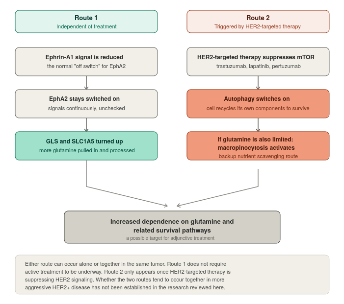

# Metabolic Pathways in HER2+ Breast Cancer

This practical introduction explains how the three main metabolic pathways affect the ER+HER2+ and ER−HER2+ phenotypes. It outlines when metabolic pathway blocking is appropriate for each treatment phase. It also identifies which repurposed drugs and natural substances have the strongest research evidence, and where uncertainty remains.

This page is for patients, supporters, and practitioners. Technical summaries support practitioners and readers seeking advanced mechanistic details about the three metabolic pathways.

## Overview

### Is metabolic pathway blocking right for you?

Consider blocking metabolic pathways when you have HER2+ breast cancer at any stage and are receiving active oncology treatment, including hormone blocking drugs. The goal is to improve effectiveness of treatment and reduce the risk of treatment resistance.

Metabolic pathway blocking is especially relevant if you are experiencing treatment resistance with metastatic disease—that is, if your metastatic disease has progressed on a current treatment line.

_Use metabolic pathway blocking as an adjunct. It does not replace HER2-targeted treatment, hormone blocking therapy, chemotherapy, or your oncology team._

### When is it appropriate to focus on other integrative protocols rather than metabolic pathways?

Broader integrative priorities like diet, lifestyle, gut health, stress management, and reducing toxic burden may offer a better focus in some situations.

* After treatment for early-stage disease, when you have stopped HER2-targeted treatment and have no evidence of disease.
* Lengthy remission from metastatic disease—with pulsing metabolic pathway blocking as a possibility.
* Early-stage triple positive completed HER2-targeted treatment but still on hormone blocking drugs— a pulsing strategy for metabolic pathway blocking may be appropriate here.

### What are the learning objectives of this guide?

#### The role of HER2 in tumour metabolism

The PI3K/AKT/mTOR overview explains how HER2 signalling rewires cancer-cell energy use.

The ER-status section adds the triple-positive context and explains ER–HER2 cross-talk and its treatment implications.

#### The three categories of metabolic pathways

The guide covers glucose pathways for HER2+ breast cancer first. This includes GLUT transporters, HK2, the pentose phosphate pathway, PKM2, LDHA, and MCT4 as well as broader glucose pathway and resistance drivers like HIF-1α, insulin/IGF-1, c-Myc, TNF-α, and FOX-O3.

Fatty-acid/lipid synthesis, glutamine/autophagy, and multi-pathway strategies for HER2+ breast cancer are under construction.

#### Adjunctive strategies using repurposed drugs and natural substances

Use the personalised-protocol section to consider the appropriate treatment phase and intensity.

Use the matrix, safety monitoring, and sourcing guidance for repurposed drugs and natural substances.

Keep evidence limits in view. Many proposed adjunctive strategies remain preclinical or lack HER2-specific clinical data.

## Part one: The three metabolic pathways and how they impact aggressiveness and treatment resistance in HER2+ breast cancer

Jump to a topic:

[The cancer phenotype](metabolic-pathways-in-her2+-breast-cancer.md#the-concept-of-metabolic-pathways-and-the-cancer-phenotype) · [HER2 signalling](metabolic-pathways-in-her2+-breast-cancer.md#the-big-picture-driving-her2-breast-cancer-pi3kaktmtor) · [ER status](metabolic-pathways-in-her2+-breast-cancer.md#the-importance-of-er-status-in-a-her2-breast-cancer) · [Repurposed drugs and natural substances](metabolic-pathways-in-her2+-breast-cancer.md#repurposed-drugs-and-natural-substances-shift-treatment-effectiveness-and-disease-resistance) · [Glucose pathways](metabolic-pathways-in-her2+-breast-cancer.md#glucose-pathwaysher2-as-a-glycolytic-phenotype) · Fatty acid pathways and lipid metabolism · [Glutamine pathways and related mechanisms](metabolic-pathways-in-her2+-breast-cancer.md#glutamine-pathways-and-related-mechanisms) · Strategies targeting multiple metabolic pathways · What we still don’t know

## Part two: Creating your personalized metabolic blocking protocol

Jump to a topic:

[Treatment phase](metabolic-pathways-in-her2+-breast-cancer.md#disease-and-treatment-phase-determinants-for-metabolic-pathway-blocking) · [Evidence and safety](metabolic-pathways-in-her2+-breast-cancer.md#how-to-reconcile-limited-evidence-with-do-no-harm) · [Creating a protocol](metabolic-pathways-in-her2+-breast-cancer.md#creating-a-protocol-from-repurposed-drugs-and-natural-substances) · [Sourcing](metabolic-pathways-in-her2+-breast-cancer.md#sourcing-repurposed-drugs-and-natural-substances)

## Part one

### The concept of metabolic pathways and the cancer phenotype

It’s well-established that cancer cells “feed” themselves differently than normal cells. That's true — but the specifics matter a lot, and they're not the same for every type of cancer or every type of breast cancer.

This is what Jane McLelland refers to as the cancer “phenotype” in her book, How to Starve Cancer, which many cancer patients read when they become interested in an integrative approach that goes beyond standard of care oncology.

### The “Big Picture” driving HER2+ breast cancer: PI3K/AKT/mTOR

When HER2 is overexpressed in cancer cells, it switches on an internal signaling cascade — PI3K → AKT → mTOR — that simultaneously rewires how the tumor handles glucose, fat, and (to a lesser extent) the amino acid glutamine.

When you see “PI3K/AKT/mTOR,” think of it as HER2's internal control panel. HER2 sits on the outside of the cell; once it's switched on, it flips this chain of internal switches, and that's what drives most of the metabolic changes that provide energy to the cancer cells.

### Other drivers of cancer metabolic pathways that feed into PI3K/AKT/mTOR

HER2 isn’t the only signal that can flip this control panel on. A separate category of upstream drivers — transcription factors and hormone signals that operate at a level above any single pathway enzyme — also feed into PI3K/AKT/mTOR. Where the research shows a specific upstream driver acting on a specific metabolic pathway (glucose, fatty acid/lipid, or glutamine), that connection is covered within the relevant pathway section below.

### The importance of ER status in a HER2+ breast cancer

About 6 in 10 HER2-positive breast cancers also test positive for hormone receptors (ER and/or PR) — a combination typically referred to as “triple-positive” whether the tumor is PR positive or negative.

The natural question is: does positive ER expression change the tumor’s metabolism beyond what’s already happening because of the HER2 expression?

The short answer is: probably yes, mechanistically — because ER and HER2 don't operate as two separate, independent systems in the same cell. They talk to each other, constantly, in both directions. This is referred to as ER-HER2 crosstalk:

• HER2 signaling can directly switch ER “on,” even without estrogen present • ER, in turn, can feed into that same PI3K/AKT/mTOR control panel that HER2 uses

Some of the earliest research that identified this ER-HER2 crosstalk found that tamoxifen could behave like an estrogen agonist (fueling growth) in HER2-overexpressing cells, rather than an antagonist (blocking it) — essentially backfiring.

But this research was done before trastuzumab (Herceptin) existed as a standard part of early-stage HER2+ treatment. The mechanism behind that backfiring effect specifically requires active, unblocked HER2 signaling — which is exactly what trastuzumab is designed to shut down.

So, this antagonistic behavior doesn’t exist when a HER2+ breast cancer is being treated with Herceptin.

To learn more about the factors to consider in taking tamoxifen, alongside trastuzumab, versus an aromatase inhibitor — see the dedicated Tamoxifen vs. AIs document \[to be added]

With that important caveat out of the way: the deeper biological point still stands. Because ER and HER2 share this PI3K/AKT/mTOR signaling line, a triple-positive tumor isn't simply “a HER2+ tumor that happens to also be ER+.”

ER may be actively shaping the metabolic program HER2 has already set in motion. But how this plays out in terms of targeted treatment effectiveness and resistance varies depending on the metabolic pathway.

### Repurposed drugs and natural substances may shift treatment effectiveness and disease resistance

Why are HER2-targeted treatments more effective in some HER2 positive breast cancers than others? The answer often lies in a specific cancer’s mutations that affect how it creates energy, which can make it less vulnerable to targeted treatments.

Why do some HER2 positive breast cancers develop resistance to those treatments? Research on HER2+ cell lines often reveal metabolic alterations the cancer creates to escape from treatment pressure.

Specific repurposed drugs and active constituents from natural substances are found to block abnormal metabolic pathways when studied in the lab.

Often, we don’t have clinical “proof” beyond the experience that integrative practitioners gain through their many years of experience working with cancer patients.

And plants don’t work as a magic bullet. Typically, several different plants must work in synergy (alongside conventional treatments) to gently shift the cancer’s ability to create energy through metabolic pathways.


The earliest research in this field typically happens in a university research lab where the focus is on finding the mutations and pathway alterations, then identifying molecules (often derived from plants) to target that pathway alteration. The goal is for a drug company to eventually make a synthetic version into a drug. These are referred to as pre-clinical studies that look at whether the plant derivative (or sometimes the whole plant) will slow down or kill the cancer cells through the specific metabolic pathway being studied. These start with in vitro studies using cancer cell lines, then may move onto animal studies that use “xenographs” or transplanted cells into the animals to create tumors. Sometimes human derived tumor tissue is used in these studies.


### Glucose pathways–HER2+ as a “glycolytic phenotype”

Among the various sub-pathways running on the label of “Glucose,” glycolysis is the pathway that defines HER2+ tumors. They are classically glycolytic — they run heavily on glucose, even when oxygen is available (a pattern often called the Warburg effect). This is a direct consequence of the HER2 → PI3K/AKT/mTOR signaling chain.

1. HER2 overactivity switches on mTOR
2. mTOR drives a shift toward glycolysis
3. This glycolytic shift is part of why HER2+ tumors can develop resistance to treatment.

This isn't just theoretical: when HER2+ breast cancer cells become resistant to the HER2-targeted drug lapatinib in lab studies, their glycolysis machinery gets rewired — and those resistant cells turn out to be more vulnerable to glycolysis-blocking treatment than before, not less.


### What is lapatinib, and how does it relate to other HER2 drugs?

Lapatinib is an older HER2-targeted pill (a tyrosine kinase inhibitor, or TKI) that works differently from drugs like trastuzumab (Herceptin), pertuzumab (Perjeta), Kadcyla, or Enhertu.

* **Trastuzumab and pertuzumab** are antibodies. They attach to the outside of the HER2 receptor and block signaling there.
* **Kadcyla and Enhertu** use the same trastuzumab antibody. They carry a cell-killing payload into the cancer cell. The antibody acts as a delivery vehicle.
* **Lapatinib** enters the cell. It blocks HER2 signaling machinery from the inside.

Because a lot of the older lab research on glucose metabolism and HER2 resistance was done using lapatinib specifically, some of those findings may be tied to lapatinib's particular way of working rather than being true of all HER2-targeted drugs. We'll flag it clearly whenever a finding is lapatinib-specific versus one that's been shown to apply more broadly.


Separately, in a clinical trial (BOLERO-3), adding an mTOR-blocking drug to standard HER2 treatment extended progression-free survival most in tumors with overactive PI3K signaling — the same signaling that drives the glycolytic shift described above.

The goal with repurposed drugs and natural substances is to assist the action of the oncology drug that is targeting the HER2 protein by putting up roadblocks against the various enzymes the cancer uses to create energy leading up to, during, and after the glycolytic shift. These are:

* [Glucose transporters (GLUTs)](metabolic-pathways-in-her2+-breast-cancer.md#glucose-transporters-gluts)
* [Hexokinase II (HK2)](metabolic-pathways-in-her2+-breast-cancer.md#hexokinase-ii-hk2)
* [Pentose phosphate pathway (PPP)](metabolic-pathways-in-her2+-breast-cancer.md#the-pentose-phosphate-pathway-ppp)
* [PFKFB3/PFKFB4](metabolic-pathways-in-her2+-breast-cancer.md#pfkfb3pfkfb4)
* [Pyruvate kinase M2 (PKM2)](metabolic-pathways-in-her2+-breast-cancer.md#pyruvate-kinase-m2-pkm2)
* [Lactate dehydrogenase A (LDHA)](metabolic-pathways-in-her2+-breast-cancer.md#lactate-dehydrogenase-a-ldha)
* [Monocarboxylate transporter 4 (MCT4)](metabolic-pathways-in-her2+-breast-cancer.md#monocarboxylate-transporter-4-mct4)

A fully referenced summary is available for integrative cancer practitioners and patients who want a deeper undertstanding. _\[insert link]_

### Glucose Transporters (GLUTs)

#### <mark style="color:$danger;">Priority for HER2+: HIGH</mark>

Before a HER2+ cancer cell can run on glucose, it first has to get glucose across its outer membrane — and it uses two different transporter proteins to do that, each with a different job.

* GLUT1 is the main glucose entry point for HER2+ cancer cells, and lab studies show HER2-driven tumors cannot form without it.
* GLUT4 normally responds to insulin in healthy cells, but HER2+ cancer cells may use it as a backup fuel line during HER2-targeted treatment.

#### Why this matters for HER2-targeted drugs:

In lab studies, trastuzumab-plus-pertuzumab-resistant HER2+ breast cancer cells had higher GLUT1 levels than treatment-sensitive cells.

Patients with higher tumor GLUT1 levels had worse outcomes, suggesting GLUT1 may support treatment resistance.

Cells resistant to trastuzumab and lapatinib activated a molecular editing process that stabilized and increased GLUT4.

Disabling this process restored sensitivity to both drugs in laboratory studies.

#### What we don't know yet:

The GLUT4 finding comes from one study and requires independent replication.

Researchers have not tested whether this GLUT4 fuel-switching occurs in triple-positive (ER+/HER2+) disease.

Sources: Wellberg et al., 2016; Madoz-Gúrpide et al., 2025; Liu et al., 2022

### Hexokinase II (HK2)

#### <mark style="color:$danger;">Priority for HER2+: HIGH</mark>

Once glucose gets inside a HER2+ cancer cell, HK2 is the enzyme that “traps” it — chemically tagging the glucose so it can't leave the cell and is committed to being burned for fuel. But HK2 does something else that matters just as much for cancer: it also helps the cell dodge its own built-in self-destruct signal.

* HK2 attaches to the outside of mitochondria, where it blocks signals that would trigger cell death.
* HK2 acts as both a fuel-processing enzyme and a survival switch.
* Lab studies show HER2-driven tumors need HK2 to form and grow, even when HK1 remains active.

#### Why this matters for HER2-targeted drugs:

HER2 keeps HK2 elevated independently of low oxygen levels.

HK2 remains elevated in HER2+ tumors because of HER2 signaling, even when oxygen is plentiful.

In trastuzumab-sensitive HER2+ cells and tumors, HK2 activity and protein levels fell as trastuzumab took effect.

These findings show HK2 is part of the treatment response but do not establish it as a resistance driver.

No study has tested whether blocking HK2 restores trastuzumab sensitivity after resistance develops.

#### A separate, related story — but not about HER2 drugs:

In estrogen-receptor-positive breast cancer, elevated HK2 has been tied to resistance against tamoxifen (a hormone-blocking drug, not a HER2-targeted one). Cells that became tamoxifen-resistant relied more heavily on HK2's mitochondrial “survival switch” function.

This is a genuine resistance mechanism — just not one that's been shown for HER2-targeted treatment specifically.

#### What we don't know yet:

Nothing currently shows HK2 blockade restores trastuzumab sensitivity in cells that have already become resistant.

The LDHA story below includes that specific test.

Tamoxifen-resistance data involves a different drug and biological context.

It concerns ER+ disease rather than HER2 blockade.

It should not be read as evidence about HER2-targeted drug resistance.

Sources: Patra et al., 2013; Laughner et al., 2001; Pan et al., 2024; Smith et al., 2013; Cheyne et al., 2011; Woo et al., 2015; Liu et al., 2019

### The Pentose Phosphate Pathway (PPP)

#### <mark style="color:$danger;">Priority for HER2+: HIGH</mark>

Some glucose entering a HER2+ cancer cell enters the pentose phosphate pathway (PPP). This pathway supports DNA and RNA production. It also creates protection against oxidative stress.

* The PPP produces building blocks for new DNA and RNA.
* It produces NADPH, which helps neutralize oxidative stress.
* G6PD is the key “on switch” enzyme for this pathway.

#### Why this matters for HER2-targeted drugs

Higher G6PD activity made breast cancer cells harder to kill with lapatinib. Extra NADPH helped cells withstand treatment-induced stress.

Blocking G6PD made lapatinib more effective in laboratory studies. It disrupted autophagy while the drug attacked HER2.

In tissue samples from 86 people with HER2+ breast cancer, DUSP4 acted as a natural brake on G6PD. It was linked to better pre-surgery treatment response and survival. Low DUSP4 and higher G6PD activity tracked with worse outcomes.

* The DUSP4 study directly tested trastuzumab resistance. It also validated the finding with trastuzumab plus pertuzumab.

Kadcyla may share this vulnerability. Its DM1 payload disrupts microtubules. Paclitaxel-resistant breast cancer cells raise G6PD, and G6PD blockade restored paclitaxel effectiveness.

* This has not been tested directly with Kadcyla.

Enhertu remains unknown. Its payload damages DNA, rather than disrupting microtubules.

* No research links its payload class to this resistance mechanism.

Tucatinib and neratinib remain untested. Like lapatinib, both are TKIs that block internal HER2 signalling.

* They are plausible candidates, but this remains a mechanistic inference.

#### What we don't know yet

These findings come from laboratory studies and one retrospective patient-record analysis.

No clinical trial has tested G6PD blockade as a treatment strategy.

Triple-positive disease has not been separately tested.

Sources: Mele et al., 2019; Wang et al., 2024; Min et al., 2022

### PFKFB3/PFKFB4

#### <mark style="color:$danger;">Priority for HER2+: HIGH</mark>

PFKFB3 is a regulatory switch that controls the speed of glycolysis. It produces a molecule that activates PFK-1, a key rate-limiting glycolysis enzyme.

* HER2 signalling directly increases PFKFB3 levels.
* More active HER2 produces more PFKFB3 and faster glycolysis.
* Higher PFKFB3 in tumour tissue has been linked to shorter progression-free survival and earlier distant spread.

#### Why this matters for HER2-targeted drugs

Lapatinib directly lowers PFKFB3 levels and glucose uptake.

A laboratory PFKFB3 inhibitor slowed growth and reduced glucose uptake in HER2-driven animal tumours. It did not have the same effect in HER2-negative tumours.

In HER2+ gastric cancer, PFKFB3 activated HER2 and created a feedback loop. Blocking PFKFB3 restored trastuzumab effectiveness in that model.

In radiotherapy patients, HER2+ tumours showed higher PFKFB3 activity than some other subtypes. Researchers did not consider it a reliable response predictor.

#### What we don't know yet

The trastuzumab-resensitising finding came from gastric cancer, not breast cancer.

No PFKFB3-blocking drug is approved for human use.

Sources: O'Neal et al., 2016; Yao et al., 2022; Egelberg et al., 2025

### Pyruvate Kinase M2 (PKM2)

#### <mark style="color:$warning;">Priority for HER2+: UNKNOWN</mark>

PKM2 catalyses glycolysis's final step. Cancer cells benefit when PKM2 works less efficiently.

* Cancer cells favour a slower PKM2 form than healthy mature cells.
* This slowdown diverts glucose-derived building blocks into cell-growth materials.
* Slow PKM2 can enter the nucleus. There, it increases production of other glycolysis genes.

#### Why this matters for HER2-targeted drugs

PKM2 connects to the HIF-1α pathway: HER2 → HIF-1α → nucleus-active PKM2 → reinforced HIF-1α and glycolysis. This creates a self-reinforcing loop.

#### What we don't know yet

PKM2 has not been directly measured or tested in HER2+ tumours. Direct evidence for treatment resistance in HER2+ disease is lacking.

Sources: General PKM2/HIF-1α mechanism; HER2-specific connection is inferential.

### Lactate Dehydrogenase A (LDHA)

#### <mark style="color:$danger;">Priority for HER2+: HIGH</mark>

LDHA converts glycolysis's end product into lactic acid. This step keeps rapid glycolysis running.

* Without LDHA, fast-glycolysis byproducts accumulate and glycolysis slows.
* HER2 signalling increases LDHA through two separate routes.
* Addressing one route may not sufficiently slow LDHA.

#### Why this matters for HER2-targeted drugs

Trastuzumab reduces glucose uptake and lactic-acid output in HER2+ cancer cells.

Combining trastuzumab with an LDHA-blocking laboratory compound worked better than trastuzumab alone. This also applied to trastuzumab-resistant cells.

In animal studies, trastuzumab could not shrink resistant tumours alone. Adding the LDHA-blocking compound restored tumour shrinkage. The effect persisted after treatment stopped.

#### What we don't know yet

The LDHA blocker is a laboratory tool, not an approved human medication.

This research did not focus on triple-positive disease.

Sources: Zhao et al., 2011

### Monocarboxylate Transporter 4 (MCT4)

#### <mark style="color:$warning;">Priority for HER2+: UNKNOWN</mark>

MCT4 exports lactic acid from glycolytic cancer cells. This prevents acid buildup inside the cell.

* Exported lactic acid acidifies the tumour environment.
* Acidification can support invasion and impair T-cell function.
* Neighbouring cells can use exported lactate as fuel.

#### Why this matters for HER2-targeted drugs

MCT4-driven acidification may weaken trastuzumab action through immune effects. This has not been tested directly.

#### What we don't know yet

No study has directly tested whether MCT4 affects HER2-targeted drug response or resistance.

Sources: General MCT4/tumour-microenvironment mechanism; HER2-specific resistance connection remains unestablished.

### Upstream drivers that act on multiple glycolytic proteins at once

GLUT1/GLUT4, HK2, PPP/G6PD, PFKFB3, PKM2, LDHA, and MCT4 are individual proteins. HER2 controls them through PI3K/AKT/mTOR. Other upstream signals can activate several proteins at once.

#### HIF-1α: A master switch behind several pathways

#### <mark style="color:$danger;">Priority for HER2+: HIGH</mark>

HIF-1α influences GLUT1, HK2, PFKFB3, PKM2, and LDHA.

* HIF-1α normally activates during low oxygen.
* In HER2+ cells, AKT stabilises HIF-1α without the low oxygen trigger.
* HER2 overexpression can keep this low-oxygen survival programme active.

HIF-1α helps explain why HER2+ tumours activate several glycolytic proteins together.

**What we don't know yet**

This foundational finding does not show that HIF-1α blockade changes HER2+ treatment response.

Sources: Li et al., 2005

#### Insulin and IGF-1 signalling

#### <mark style="color:$warning;">Priority for HER2+: MIXED, MAY DEPEND ON BMI</mark>

Insulin and IGF-1 can activate the same PI3K/AKT/mTOR wiring as HER2.

* HER2+ breast cancer cells express insulin and IGF-1 receptors.
* High insulin or IGF-1 can activate glycolytic genes independently of HER2.
* IGF-1R can provide acquired trastuzumab resistance. It can restore PI3K/AKT output after HER2 blockade.
* One of five HER2+ molecular subtypes was linked to poorer outcomes involving IGF-1 and AKT/mTOR signalling.

**What we don't know yet**

The meaning of an individual IGF-1 level remains unsettled. One unreplicated study linked higher IGF-1 to better outcomes in non-overweight patients and worse outcomes in overweight patients.

Sources: Luo et al., 2021; Rediti et al., 2024

#### c-Myc

#### <mark style="color:$warning;">Priority for HER2+: UNKNOWN</mark>

c-Myc directly activates genes for several glycolytic proteins. It operates through a different route than HIF-1α.

* Laboratory studies outside HER2+ breast cancer show c-Myc increases GLUT1 and rate-limiting glycolysis enzymes.
* A 2023 HER2+ breast cancer study linked S100A9 to active c-Myc and higher glycolysis. It did not test c-Myc directly.
* In triple-negative breast cancer cells, silibinin lowered EGFR and c-Myc. Direct metabolic testing confirmed lower glycolysis.

**What we don't know yet**

No study has directly changed c-Myc activity in HER2+ breast cancer cells to test glycolysis.

Sources: Osthus et al., 2000; Dang et al., 2009; Kleszcz et al., 2018; Lin et al., 2025; Zhang et al., 2023; Cargill et al., 2021; Yuan et al., 2023; Wang et al., 2020; Iqbal et al., 2021

#### TNF-α: An inflammatory driver of glycolysis

#### <mark style="color:$warning;">Priority for HER2+: UNKNOWN</mark>

TNF-α is an inflammatory signal released by immune cells.

* A 2013 study demonstrated increased glycolysis, lactate release, and GLUT1 in normal and cancerous breast cells using TNF-α.
* The metabolic shift occurred without adding a cancer-causing mutation.
* Curcumin partially reversed these changes in a dose-dependent manner.

**What we don't know yet**

This finding comes from one breast-cell-line study. It did not focus on HER2+ disease or use an animal model. Clinical benefit from curcumin in this context remains untested.

Sources: Vaughan et al., 2013

### What about OXPHOS in ER+HER2+ breast cancer?

#### <mark style="color:$warning;">Priority for HER2+: MIXED, NOT FOR ENERGY BUT INFUENCES CELL DEATH</mark>

OXPHOS generates energy in mitochondria. Glycolysis occurs in the cell fluid. Cells can use both pathways.

* A 2024 study found higher OXPHOS-related proteins in trastuzumab-resistant HER2+ cells. Those cells also consumed more glucose and produced more lactate.
* An independent study of another anti-HER2 combination reported the same pattern.
* Both teams concluded that **OXPHOS proteins may help resistant cells evade programmed cell death**. They may not primarily generate energy.
* In a 503-patient study, high OXPHOS activity predicted worse outcomes only in ER+/HER2-negative diseas&#x65;**. The association disappeared in HER2-positive tumours, including triple-positive disease.**

#### Bottom line for triple-positive disease

Glycolysis remains the dominant glucose pathway in HER2+ disease, including triple-positive disease. Increased OXPHOS proteins in HER2+ breast cancer **do not** show that a tumour has abandoned glycolysis.

Sources: Tapia et al., 2024; Gale et al., 2020; El-Botty et al., 2023

### Fatty acid pathways and lipid metabolism

_Placeholder for future addition._

### Glutamine pathways and related mechanisms

Glutamine is the most abundant amino acid in the bloodstream. Cancer cells use it for fuel, DNA and RNA building blocks, and glutathione production.

Some cancers depend heavily on glutamine. Triple-negative breast cancer is a leading example. HER2-positive disease is different from triple negative because its glutamine dependence is conditional, rather than universal.

Two distinct routes may increase glutamine dependence in HER2-positive tumours. Either route may occur alone. Both may occur in the same tumour.

<figure><figcaption></figcaption></figure>

#### Two independent routes to glutamine dependency

* **Route 1** runs through the EphA2 receptor. It does not require active treatment.
* **Route 2** starts after HER2-targeted therapy suppresses mTOR signalling.

Route 2 can activate autophagy. Glutamine limitation or autophagy blockade can then activate macropinocytosis.

### Route 1: The EphA2 pathway

#### What is EphA2?

EphA2 is a cell-surface receptor found alongside HER2. It is overexpressed in many invasive breast cancers. It is more common in ER-positive than ER-negative disease.

Under normal conditions, ephrin-A1 acts as EphA2’s brake. Ephrin-A1 binding pulls EphA2 into the cell for breakdown. Reduced ephrin-A1 leaves EphA2 continuously active.

Active EphA2 can promote:

* Invasion and blood-vessel growth.
* Greater glutamine dependence.
* Treatment resistance.

In trastuzumab-resistant HER2-positive models:

* EphA2 levels were elevated.
* Raising EphA2 alone caused resistance.

EphA2 also links to lower tamoxifen sensitivity in ER-positive disease. An EphA2-high tumour may therefore develop resistance across several fronts. This includes anti-HER2 treatment, endocrine treatment, and glutamine metabolism.

#### GLS and SLC1A5

SLC1A5, also called ASCT2, transports glutamine into the cell. GLS, or glutaminase, converts glutamine into glutamate. This is the first rate-limiting glutamine-breakdown step.

Active EphA2 increases both SLC1A5 and GLS. It uses separate internal signalling routes to do so. The result is greater glutamine uptake and processing.

#### Why this matters for HER2-targeted drugs

In EphA2-high laboratory models, the GLS inhibitor CB-839, also called telaglenastat, slowed tumour growth. EphA2-high HER2-positive cells were more sensitive than EphA2-low cells. This applied in cell culture and animal models.

High EphA2 expression also correlates with shorter survival in HER2-positive breast cancer. However, HER2 status alone does not determine metabolic behaviour.

One early study found little GLS-inhibitor activity in typical hormone-receptor-positive HER2-positive models. It showed activity in a HER2-positive line with triple-negative-like metabolism. However, this does not establish that ER-negative HER2-positive tumours behave like triple-negative disease.

#### Why GLS blockers may underperform

Clinical GLS-inhibitor trials have not produced positive results. Laboratory work suggests one explanation. Some glutamine-dependent cells bypass blocked GLS through PSAT1. This pathway creates the same downstream fuel through a different route.


PSAT1 adaptation has been shown in triple-negative breast cancer cells. It has not been shown in HER2-positive models. No HER2-positive-specific GLS-inhibitor trial has been completed.


#### GDH: a downstream enzyme

GDH converts glutamate into α-ketoglutarate. This molecule feeds the cell’s core energy-producing cycle.

GDH has not been directly tested in the EphA2 pathway. Its inclusion reflects its downstream metabolic position. It does not show a demonstrated EphA2 connection.

* GDH can promote tumours in several cancer types.
* Breast cancer findings are mixed:
  * High GDH had favourable associations in some low-grade, hormone-receptor-positive, and triple-negative disease.
  * HER2-positive tumours showed no significant association.

**What we do not know:** GDH’s role in HER2-positive breast cancer remains untested.

Sources: Youngblood et al., 2016; Zhuang et al., 2010; Edwards et al., 2017; Gökmen-Polar et al., 2011; Lu et al., 2003; Gross et al., 2014; Qiu et al., 2024; Zhang et al., 2016; Yin et al., 2022; Craze et al., 2019

### Route 2: The treatment-triggered stress response

Route 2 is not a glutamine-processing step. It is a survival response to metabolic stress from HER2-targeted therapy.

1. Active HER2 signalling keeps mTOR switched on. Active mTOR suppresses autophagy.
2. HER2-targeted therapy can lower mTOR activity. This removes autophagy suppression.
3. The cancer cell activates autophagy. It recycles internal components under treatment pressure.
4. Glutamine limitation or p62/NRF2 signalling can activate macropinocytosis. This provides an alternative nutrient supply.

Autophagy and macropinocytosis are included here because they share this mTOR context. Neither is a direct glutamine-processing step.

### Autophagy: a primary resistance mechanism

#### Why this matters for HER2-targeted drugs

HER2-positive breast-cancer cells chronically exposed to trastuzumab develop elevated autophagy. In laboratory studies, chloroquine blocked autophagy and restored trastuzumab sensitivity.

This response can occur early. A neoadjuvant trastuzumab study found increased autophagy markers after one treatment cycle. A similar resistance pattern was later shown with T-DM1.

Autophagy-driven resistance has not been tested with trastuzumab deruxtecan or neratinib. It should not be assumed but is mechanistically plausible.

GSDMB provides an additional HER2-positive-specific signal:

* GSDMB sits next to HER2 on the chromosome and is frequently co-amplified with HER2.
* GSDMB promotes a specific autophagy step.
* High co-expression of GSDMB and downstream partners correlated with relapse.


Autophagy blockade is not automatically beneficial in every setting. One laboratory study found that a potent autophagy blocker called bafilomycin impaired trastuzumab-supported immune killing. Hydroxychloroquine has not been tested for this effect. Discuss any autophagy-blocking strategy with the prescribing oncology team.


#### Clinical evidence and safety

The CLEVER trial tested hydroxychloroquine plus everolimus in high-risk early-stage breast-cancer survivors. It included HER2-positive participants with detectable dormant tumour cells in bone marrow. _At five years, every HER2-positive participant across treatment arms remained recurrence-free._

This was a small early-phase trial. It is promising, but not standard care.

A Phase I trial, NCT03774472, studied palbociclib, letrozole, and hydroxychloroquine in metastatic ER-positive/HER2-negative disease. It found that palbociclib could trigger autophagy escape, which hydroxychloroquine blocked. _Two participants had substantial tumour shrinkage for nearly 300 days._

The newly approved PATINA regimen adds palbociclib to HER2-targeted maintenance treatment for HR-positive/HER2-positive metastatic disease. _Whether the same autophagy escape occurs in triple-positive disease remains unknown._


NCT03774472 used hydroxychloroquine 800 mg daily. This exceeds the chronic-dose threshold in current ophthalmology guidance. Ask the prescribing clinician about baseline and ongoing retinal screening.


**What we do not know:**

Autophagy inhibition has not been tested alongside trastuzumab deruxtecan or neratinib.

GSDMB measurement has not been validated for selecting patients.

Palbociclib-triggered autophagy escape remains untested in triple-positive disease.

Sources: Vázquez-Martín et al., 2009; Koukourakis et al., 2014; Zhang et al., 2021; Gámez-Chiachio et al., 2022; Bede et al., 2025; DeMichele et al., 2025, 2026; Raghavendra et al., 2025; Loibl et al., 2026

### Macropinocytosis: a backup fuel line

Macropinocytosis lets a cell engulf extracellular fluid and protein debris. It then breaks this material down for nutrients. It is a scavenging response when usual fuel supplies are constrained.

PI3K signalling can activate macropinocytosis. Because HER2 drives PI3K signalling, HER2-positive tumours may be primed to use this route under stress.

In triple-negative models, complete SLC1A5 deletion increased macropinocytosis five- to ten-fold. This preserved intracellular glutamine and growth. Partial transporter reduction did not cause this response.

Autophagy blockade can also activate macropinocytosis through NRF2 signalling. Blocking one survival route may therefore activate another.

**What we do not know:**

Macropinocytosis has not been measured directly in HER2-positive breast cancer during treatment. Its relevance here is inferred from shared signalling biology.

Sources: Wahi et al., 2024; Su et al., 2021

### Related cellular disposal mechanisms

#### Nucleoside salvage

Nucleoside salvage is a backup route for building DNA and RNA. New nucleotide production normally needs glutamine-derived nitrogen. When glutamine is scarce, cells can recycle extracellular nucleosides. Nearby dying tumour cells may provide this material.

The rationale for blocking this route is mechanism-only. It has not been tested directly against tumour growth.

#### Proteasomes

Proteasomes dispose of damaged and unwanted proteins. They also remove proteins that might otherwise trigger cell death.

PSMD3, a proteasome component, can stabilise HER2 directly. Lowering PSMD3 destabilised HER2 and caused cell death in HER2-positive models. Higher PSMD3 predicted worse survival.

This supports further investigation of proteasome-targeting approaches. It does not establish an effective HER2-positive treatment strategy.

#### Apigenin: a combination hypothesis with a caution

Apigenin has proteasome-inhibiting activity. However, in one laboratory study, it also triggered protective autophagy in breast-cancer cells. Blocking that autophagy increased apigenin’s cell-killing effect.

Pairing apigenin with Hydroxychloroquine or Withaferin A remains a hypothesis. A different laboratory compound, not Hydroxychloroquine, was tested in that study.

Sources: Revalde et al., 2017; Fararjeh et al., 2019; Cao et al., 2013

### Glutamine dependency in triple-positive disease

No study has directly measured glutamine use by triple-positive tumours. The following points are informed inferences.

ER and HER2 can influence each other. One resistant-cell model linked this crosstalk to c-MYC activation and higher glutamine-transporter levels. The model did not reflect typical HER2-driven triple-positive disease.

EphA2 is more often overexpressed in ER-positive than ER-negative tumours. If this pattern applies to triple-positive disease, the EphA2 route may be especially relevant.

Sources: Chen et al., 2015; Pan, 2005

### Strategies targeting multiple metabolic pathways

_Placeholder for future addition._

### What we still don’t know

_Placeholder for future addition._

## Part two

### Disease and treatment phase determinants for metabolic pathway blocking

The appropriate metabolic approach depends on disease stage and treatment phase. Obtain regular labs, including a comprehensive metabolic panel, to monitor kidney and liver function.

This discussion addresses metabolic pathway blocking only. Other upstream pathways and cancer stem cells remain important regardless of treatment phase.

#### 1. Early stage in active oncology treatment

This includes chyemotherapy + HP or ADCs like Kadcyla or Enhertu used in early-stage oncology protocols.

* Consider metabolic pathway blocking as an adjunct to oncology treatment.
* Pulsing may reduce pill burden and digestive distress. This can mean one week to one month on, followed by one week to one month off.
* Consider interactions between natural substances and oncology drugs.

#### 2. Early-stage remission with maintenance or additional treatment

This includes Herceptin, Perjeta, Phesgo, Kadcyla, Neratinib, Ibrance, and hormone blockers.

* Resistant cancer cells may develop mutations that preserve energy production.
* Pulsing may reduce pill burden and digestive distress.
* Prioritise diet, lifestyle, gut health, and toxic burden. Metabolic blocking is an enhancement, not a replacement.

#### 3. Early-stage triple-positive remission on hormone blockade only

This includes Tamoxifen, Zoladex, and/or AIs.

* Resistance to hormone blockers can preserve cancer-cell energy production.
* Pulsing may reduce pill burden and digestive distress.
* Intensify diet, lifestyle, gut health, and toxic-burden efforts. Metabolic blocking remains an enhancement.

#### 4. Early-stage ER-negative, HER2-positive remission without HER2-targeted drugs

* Continue prioritising diet, lifestyle, gut health, and toxic burden.
* With no evidence of disease and no oncology drugs, metabolic pathway blocking is no longer necessary or appropriate.

#### 5. Newly diagnosed metastatic disease or metastatic disease with maintenance HER2 treatment

* Consider metabolic pathway blocking as an adjunct to oncology treatment.
* Potentially favour off-label drugs over supplements because of their targeted action.
* Consider interactions between natural substances and oncology drugs.
* Pulsing may reduce pill burden and digestive distress.
* Support diet, lifestyle, gut health, and toxic burden within treatment-symptom limits.
* Refer to site-specific guides for bone, liver, lung, skin, and brain metastases.

#### 6. Metastatic progression after one or more treatment lines

* Consider metabolic pathway blocking as an adjunct to oncology treatment.
* Multiple pathway mutations may require simultaneous pathway targeting.
* You may favour off-label drugs over supplements because of their targeted action.
* Consider drug interactions and clinical-trial rules.
* Pulsing may reduce pill burden and digestive distress.
* Focus on blood-sugar control, stress management, and gut support.
* Refer to site-specific guides for bone, liver, lung, skin, and brain metastases.

### How to reconcile limited evidence with “do no harm”

Many patients cannot wait for a new oncology drug to be developed and tested. Some drugs have unacceptable side effects. Natural substances or repurposed drugs with established safety profiles may provide alternatives.

Practitioners use clinical experience to identify drugs and substances that may shift outcomes. Partner with an integrative doctor, supportive GP, or forward-thinking oncologist who can identify interactions and monitor organ function.

### Creating a protocol from repurposed drugs and natural substances

Most evidence remains preclinical. It may come from HER2+ cell lines, other breast cancer subtypes, or other solid tumours.

#### How to use the matrix

1. Review the pathways and determine which ones to prioritize based on the research shared here.
2. Start with drugs and supplements already in your protocol.
3. Cover each prioritised pathway with more than one substance. Drugs are often stronger blockers than supplements.
4. Dose drugs and supplements appropriately _\[link to dosing guidelines to be added]_.
5. Consider pulsing during remission or treatment challenges.
6. Choose potent products within your budget.

### Sourcing repurposed drugs and natural substances

_\[General resource to be added.]_

### References

Bede, Á. M., et al. (2025). The autophagy inhibitor bafilomycin inhibits antibody-dependent natural killer cell-mediated killing of breast carcinoma cells. _International Journal of Molecular Sciences, 26_(4), 1533. https://doi.org/10.3390/ijms26041533

Cao, X., et al. (2013). Autophagy inhibition enhances apigenin-induced apoptosis in human breast cancer cells. _Chinese Journal of Cancer Research, 25_(2), 212–222. https://doi.org/10.3978/j.issn.1000-9604.2013.04.01

Chen, Z., Wang, Y., Warden, C., & Chen, S. (2015). Cross-talk between ER and HER2 regulates c-MYC-mediated glutamine metabolism in aromatase inhibitor resistant breast cancer cells. _Journal of Steroid Biochemistry and Molecular Biology, 149_, 118–127. https://doi.org/10.1016/j.jsbmb.2015.02.004

Craze, M. L., et al. (2019). Glutamate dehydrogenase (GLUD1) expression in breast cancer. _Breast Cancer Research and Treatment, 174_(1), 79–91. https://doi.org/10.1007/s10549-018-5060-z

DeMichele, A., et al. (2025). Targeting dormant tumor cells to prevent recurrent breast cancer: A randomized phase 2 trial. _Nature Medicine, 31_(10), 3464–3474. https://doi.org/10.1038/s41591-025-03877-3

Edwards, D. N., et al. (2017). EphA2 promotes glutamine metabolism through YAP and TAZ. _Science Signaling, 10_(508), eaan4667. https://doi.org/10.1126/scisignal.aan4667

Fararjeh, A. S., et al. (2019). PSMD3 regulates breast cancer by stabilizing HER2 from degradation. _Cancers, 11_(4), 527. https://doi.org/10.3390/cancers11040527

Gámez-Chiachio, M., et al. (2022). Gasdermin B over-expression induces protective autophagy in HER2-targeted therapy resistance. _Journal of Experimental & Clinical Cancer Research, 41_, 292. https://doi.org/10.1186/s13046-022-02506-y

Gökmen-Polar, Y., et al. (2011). Dual targeting of EphA2 and ER restores tamoxifen sensitivity. _Breast Cancer Research and Treatment, 127_(2), 375–384. https://doi.org/10.1007/s10549-010-1004-y

Gross, M. I., et al. (2014). Antitumor activity of the glutaminase inhibitor CB-839 in triple-negative breast cancer. _Molecular Cancer Therapeutics, 13_(4), 890–901. https://doi.org/10.1158/1535-7163.MCT-13-0870

Koukourakis, M. I., et al. (2014). Neoadjuvant analysis identifies a role for autophagy in trastuzumab resistance. _British Journal of Cancer, 110_(9), 2209–2216. https://doi.org/10.1038/bjc.2014.196

Loibl, S., et al. (2026). Trastuzumab deruxtecan in residual HER2-positive early breast cancer. _New England Journal of Medicine, 394_(9), 845–857. https://doi.org/10.1056/NEJMoa2514661

Lu, M., et al. (2003). EphA2 overexpression decreases estrogen dependence and tamoxifen sensitivity. _Cancer Research, 63_(12), 3425–3429.

Pan, M. (2005). Overexpression of EphA2 gene in invasive human breast cancer and its association with hormone receptor status. _Journal of Clinical Oncology, 23_(16 Suppl.), Abstract 9583. https://doi.org/10.1200/jco.2005.23.16\_suppl.9583

Qiu, Y., et al. (2024). PSAT1 mediates metabolic adaptation to glutamine blockade. _Nature Metabolism, 6_(8), 1529–1548. https://doi.org/10.1038/s42255-024-01104-w

Raghavendra, A. S., et al. (2025). Hydroxychloroquine to enhance palbociclib and letrozole efficacy in ER-positive/HER2-negative breast cancer. _NPJ Breast Cancer, 11_, 7. https://doi.org/10.1038/s41523-025-00722-1

Revalde, J. L., et al. (2017). Curcumin and its analogue inhibited ENT1 in pancreatic cancer cells. _European Journal of Pharmacology, 803_, 167–173. https://doi.org/10.1016/j.ejphar.2017.03.055

Su, H., et al. (2021). Cancer cells escape autophagy inhibition via NRF2-induced macropinocytosis. _Cancer Cell, 39_(5), 678–693. https://doi.org/10.1016/j.ccell.2021.02.016

Vázquez-Martín, A., Oliveras-Ferraros, C., & Menendez, J. A. (2009). Autophagy facilitates trastuzumab resistance. _PLoS ONE, 4_(7), e6251. https://doi.org/10.1371/journal.pone.0006251

Wahi, K., et al. (2024). Macropinocytosis mediates resistance to loss of glutamine transport in triple-negative breast cancer. _The EMBO Journal, 43_(23), 5857–5882. https://doi.org/10.1038/s44318-024-00271-6

Youngblood, V. M., et al. (2016). The ephrin-A1/EPHA2 axis regulates glutamine metabolism in HER2-positive breast cancer. _Cancer Research, 76_(7), 1825–1836. https://doi.org/10.1158/0008-5472.CAN-15-0847

Zhang, J., et al. (2016). GDH regulates bioenergetics and redox homeostasis in human glioma. _Oncotarget, 7_(9), 8674–8685. https://doi.org/10.18632/oncotarget.7657

Zhang, J., et al. (2021). Targeting autophagy promoted antitumor effects of T-DM1 in HER2-positive gastric cancer. _Cell Death & Disease, 12_, 240. https://doi.org/10.1038/s41419-021-03535-7

Zhuang, G., et al. (2010). EphA2 elevation mediates resistance to trastuzumab therapy. _Cancer Research, 70_(1), 299–308. https://doi.org/10.1158/0008-5472.CAN-09-1845

Chen, Y., Zhang, J., Zhang, M., Song, Y., Zhang, Y., Fan, S., Ren, S., Fu, L., Zhang, N., Hui, H., & Shen, X. (2021). Baicalein resensitizes tamoxifen-resistant breast cancer cells by reducing aerobic glycolysis and reversing mitochondrial dysfunction via inhibition of hypoxia-inducible factor-1α. _Clinical and Translational Medicine, 11_(11), e577. https://doi.org/10.1002/ctm2.577

Cheyne, R. W., Trembleau, L., McLaughlin, A., & Smith, T. A. D. (2011). Changes in 2-fluoro-2-deoxy-D-glucose incorporation, hexokinase activity and lactate production by breast cancer cells responding to treatment with the anti-HER-2 antibody trastuzumab. _Nuclear Medicine and Biology, 38_(3), 339–346. https://doi.org/10.1016/j.nucmedbio.2010.09.005

Egelberg, M., De Marchi, T., Schultz, N., Tran, L., Karlsson, P., Holmberg, E., Pekar, G., Killander, F., & Niméus, E. (2025). The potential radiosensitization target PFKFB3 is related to response to radiotherapy in SweBCG91RT. _BMC Cancer, 25_(1), Article 374. https://doi.org/10.1186/s12885-025-13703-1

Iqbal, M. A., Chattopadhyay, S., Siddiqui, F. A., Ur Rehman, A., Siddiqui, S., Prakasam, G., Khan, A., Sultana, S., & Bamezai, R. N. K. (2021). Silibinin induces metabolic crisis in triple-negative breast cancer cells by modulating EGFR-MYC-TXNIP axis. _The FEBS Journal, 288_(2), 471–485. https://doi.org/10.1111/febs.15353

Laughner, E., Taghavi, P., Chiles, K., Mahon, P. C., & Semenza, G. L. (2001). HER2 signalling increases HIF-1α synthesis. _Molecular and Cellular Biology, 21_(12), 3995–4004. https://doi.org/10.1128/MCB.21.12.3995-4004.2001

Liu, H., Lyu, H., Jiang, G., Chen, D., Ruan, S., Liu, S., Zhou, L., Yang, M., Zeng, S., He, Z., Wang, H., Li, H., Zheng, G., & Liu, B. (2022). ALKBH5-mediated m6A demethylation of GLUT4 mRNA promotes glycolysis and resistance to HER2-targeted therapy. _Cancer Research, 82_(21), 3974–3986. https://doi.org/10.1158/0008-5472.CAN-22-0800

Mele, L., la Noce, M., Paino, F., Regad, T., Wagner, S., Liccardo, D., Papaccio, G., Lombardi, A., Caraglia, M., Tirino, V., Desiderio, V., & Papaccio, F. (2019). Glucose-6-phosphate dehydrogenase blockade potentiates tyrosine kinase inhibitor effect on breast cancer cells. _Journal of Experimental & Clinical Cancer Research, 38_(1), 160. https://doi.org/10.1186/s13046-019-1164-5

Min, H.-Y., Lee, H. J., Suh, Y.-A., Pei, H., Kwon, H., Jang, H.-J., Yun, H. J., Moon, H.-G., & Lee, H.-Y. (2022). Targeting epidermal growth factor receptor in paclitaxel-resistant human breast and lung cancer cells with upregulated G6PD. _British Journal of Cancer, 127_(4), 661–674. https://doi.org/10.1038/s41416-022-01843-1

O’Neal, J., Clem, A., Reynolds, L., Dougherty, S., Imbert-Fernandez, Y., Telang, S., Chesney, J., & Clem, B. F. (2016). Inhibition of PFKFB3 suppresses glucose metabolism and growth of HER2+ breast cancer. _Breast Cancer Research and Treatment, 160_(1), 29–40. https://doi.org/10.1007/s10549-016-3968-8

Patra, K. C., Wang, Q., Bhaskar, P. T., Miller, L., Wang, Z., Wheaton, W., Chandel, N., Laakso, M., Muller, W. J., Allen, E. L., Jha, A. K., Smolen, G. A., Clasquin, M. F., Robey, B., & Hay, N. (2013). Hexokinase 2 is required for tumour initiation and maintenance. _Cancer Cell, 24_(2), 213–228. https://doi.org/10.1016/j.ccr.2013.06.014

Ruprecht, B., Zaal, E. A., Zecha, J., Wu, W., Berkers, C. R., Kuster, B., & Lemeer, S. (2017). Lapatinib resistance is accompanied by glycolysis reprogramming. _Cancer Research, 77_(8), 1842–1853. https://doi.org/10.1158/0008-5472.CAN-16-2976

Smith, T. A. D., Appleyard, M. V. C. L., Sharp, S., Fleming, I. N., Murray, K., & Thompson, A. M. (2013). Trastuzumab response is accompanied by decreased HK2 and GLUT1. _Cancer Chemotherapy and Pharmacology, 71_(2), 473–480. https://doi.org/10.1007/s00280-012-2032-6

Vaughan, R. A., Garcia-Smith, R., Dorsey, J., Griffith, J. K., Bisoffi, M., & Trujillo, K. A. (2013). TNF-α induces Warburg-like metabolism and is reversed by curcumin. _International Journal of Cancer, 133_(10), 2504–2510. https://doi.org/10.1002/ijc.28264

Wang, X., Chi, W., Ma, Y., Zhang, Q., Xue, J., Shao, Z. M., Xiu, B., Wu, J., & Chi, Y. (2024). DUSP4 enhances therapeutic sensitivity in HER2-positive breast cancer. _Translational Oncology, 46_, Article 102016. https://doi.org/10.1016/j.tranon.2024.102016

Yao, X., He, Z., Qin, C., Zhang, P., Sui, C., Deng, X., Fang, Y., Li, G., & Shi, J. (2022). PFKFB3 inhibition improves trastuzumab sensitivity in HER2-positive gastric cancer. _British Journal of Cancer, 127_(5), 811–823. https://doi.org/10.1038/s41416-022-01834-2

Yuan, J. Q., Wang, S. M., & Guo, L. (2023). S100A9 promotes glycolytic activity in HER2-positive breast cancer. _Heliyon, 9_(2), Article e13294. https://doi.org/10.1016/j.heliyon.2023.e13294

Zhao, Y., Liu, H., Liu, Z., Ding, Y., Ledoux, S. P., Wilson, G. L., Voellmy, R., Lin, Y., Lin, W., Nahta, R., Liu, B., Fodstad, O., Chen, J., Wu, Y., Price, J. E., & Tan, M. (2011). Overcoming trastuzumab resistance by targeting dysregulated glucose metabolism. _Cancer Research, 71_(13), 4585–4597. https://doi.org/10.1158/0008-5472.CAN-10-4038
