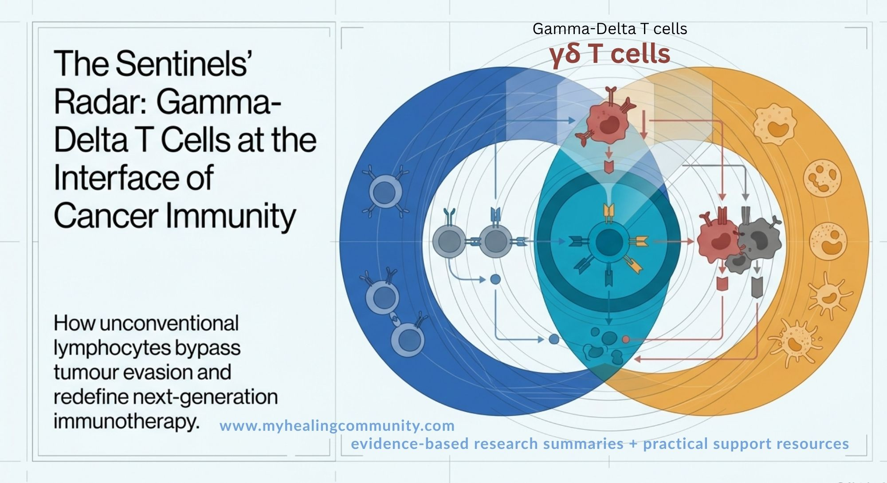
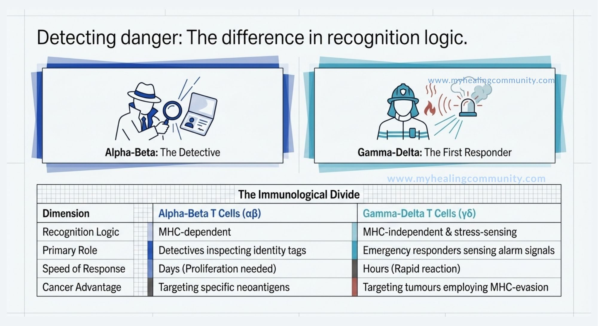
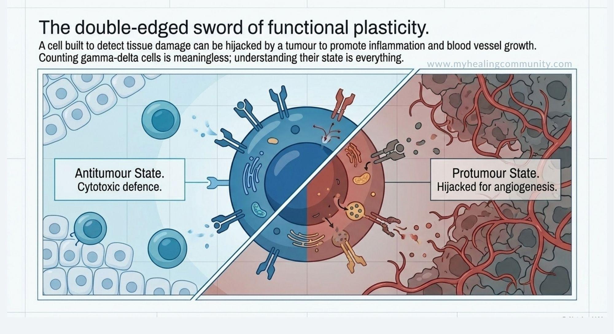
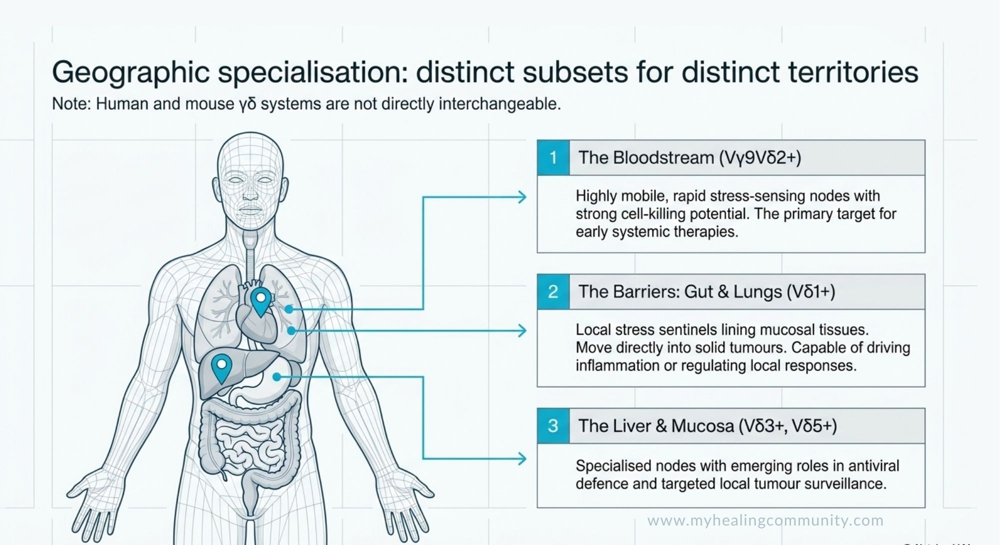
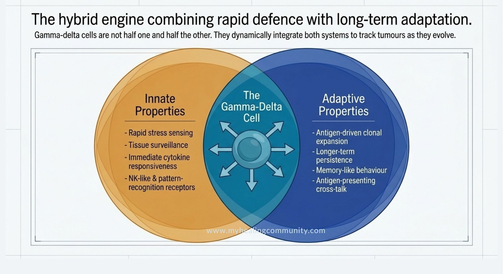
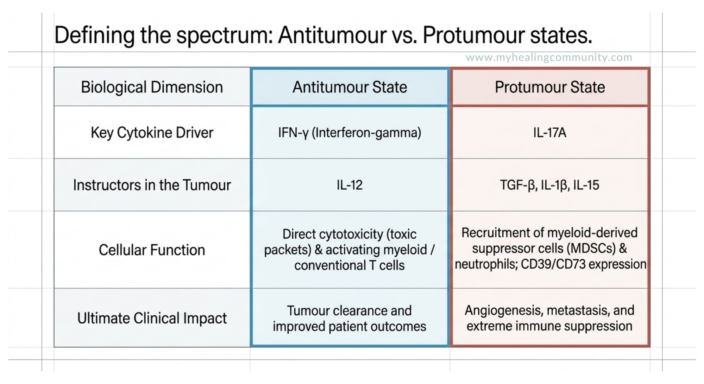
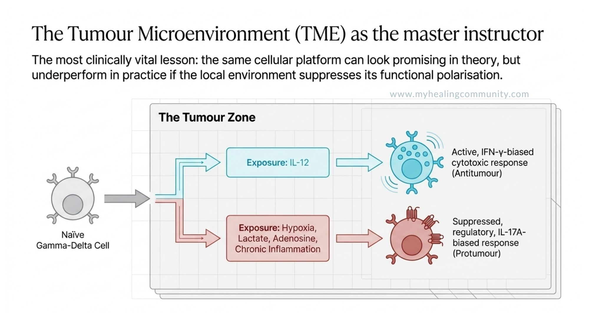

# Gamma–delta T cells in cancer: a 2026 research review

<figure><figcaption></figcaption></figure>


This patient and practitioner-facing summary examines a 2026 review of gamma–delta T cells in cancer.

**Key reference:** Solé Casaramona A, Bachmann MF, Sevick‑Muraca E, Mohsen MO. [γδ T cells at the interface of innate and adaptive immunity in cancer](https://jitc.bmj.com/content/14/3/e013668). _Journal for ImmunoTherapy of Cancer_. 2026;14:e013668.


### Contents

* [First things first: what are gamma–delta T cells?](gamma-delta-t-cells-in-cancer-a-2026-research-review.md#first-things-first-what-are-gamma-delta-t-cells)
* [Overview of the 2026 review article](gamma-delta-t-cells-in-cancer-a-2026-research-review.md#overview-of-the-2026-review-article)
* [The core idea](gamma-delta-t-cells-in-cancer-a-2026-research-review.md#the-core-idea)
* [What makes gamma–delta T cells different](gamma-delta-t-cells-in-cancer-a-2026-research-review.md#what-makes-gamma-delta-t-cells-different)
* [Subsets made easier](gamma-delta-t-cells-in-cancer-a-2026-research-review.md#subsets-made-easier)
* [How gamma–delta T cells bridge innate and adaptive immunity](gamma-delta-t-cells-in-cancer-a-2026-research-review.md#how-gamma-delta-t-cells-bridge-innate-and-adaptive-immunity)
* [Tumor surveillance](gamma-delta-t-cells-in-cancer-a-2026-research-review.md#tumor-surveillance)
* [What the paper says about immunotherapy](gamma-delta-t-cells-in-cancer-a-2026-research-review.md#what-the-paper-says-about-immunotherapy)
* [Experimental platforms](gamma-delta-t-cells-in-cancer-a-2026-research-review.md#experimental-platforms)
* [Clinical challenges](gamma-delta-t-cells-in-cancer-a-2026-research-review.md#clinical-challenges)
* [Clear takeaways](gamma-delta-t-cells-in-cancer-a-2026-research-review.md#clear-takeaways)
* [Professional reading of the paper’s contribution](gamma-delta-t-cells-in-cancer-a-2026-research-review.md#professional-reading-of-the-papers-contribution)

### First things first: what are gamma–delta T cells?

T cells are white blood cells that help the immune system recognise and respond to trouble, including infections and cancer. They do this with a “sensor” on their surface called a T-cell receptor (TCR), which is made from two protein chains.

Most T cells use an alpha–beta receptor, so they are called alpha–beta (αβ) T cells. The smaller, special group this report focuses on uses a gamma–delta receptor instead, so they are called gamma–delta T cells.

In the original science paper, these cells are written with Greek letters as γδ T cells. To keep this report easy to read, the English words “gamma–delta” are used rather than the symbols.

**Because their receptor is different, gamma–delta T cells can notice stress, damage, and early cancer changes in ways that ordinary T cells often miss.** They are like extra sentinels, looking for signs that something in a tissue is not right even when a tumor is trying to hide.

### Overview of the 2026 review article

This report unpacks the 2026 review article “γδ T cells at the interface of innate and adaptive immunity in cancer” by Arnau Solé Casaramona, Martin F Bachmann, Eva Sevick-Muraca, and Mona O Mohsen, published in the Journal for ImmunoTherapy of Cancer. The paper presents gamma–delta T cells as an important immune population that does not fit neatly into the old split between “innate” and “adaptive” immunity, and explains why that matters for cancer and for next-generation immunotherapy.

A simple way to read the paper is this: gamma–delta T cells are built for fast sensing and flexible response. They can react quickly, like first-line innate defences, but they can also expand, adapt, and persist in ways that look more like longer-term adaptive immunity.

The authors argue that gamma–delta T cells can recognise stress, transformation, and disturbed metabolism without relying on classical MHC presentation. That makes them especially interesting in cancers that hide from conventional T cells by changing or losing the usual “identity tags” on their surface.

For people dealing with cancer, this is important because many current immunotherapies work best when tumor antigens are clearly shown to alpha–beta T cells. Gamma–delta T cells can still detect and attack cancer that is not seen by those alpha–beta T cells.

<figure><figcaption></figcaption></figure>

### The core idea

The paper describes gamma–delta T cells as “unconventional lymphocytes” that sit at the boundary between innate and adaptive immunity. In plain terms, that means they do not have to wait for the same style of antigen presentation that conventional T cells usually need before acting.

Instead, gamma–delta T cells can sense small danger signals from cells under stress. These signals can include unusual chemicals, fats, and other surface changes that appear when a cell is infected, damaged, or starting to become cancerous. Using their own special receptor, along with other built-in sensors, gamma–delta T cells can respond quickly when something is wrong.

An easy metaphor is this: alpha–beta T cells often act like detectives checking identity papers, while gamma–delta T cells also act like emergency responders who notice smoke, broken glass, and alarm signals. The paper’s central message is that cancer often creates exactly those abnormal stress signals, which is why gamma–delta T cells are so relevant.

### What makes gamma–delta T cells different

The review emphasises three features that make gamma–delta T cells unusual in cancer.

* They recognise danger in an MHC-independent way, which helps them respond to tumors that evade classical antigen presentation.
* They are highly diverse, with distinct subsets that live in different tissues and behave differently under different cytokine and metabolic conditions.
* **They can help or harm**, because some gamma–delta T-cell states are strongly antitumor while others can support inflammation, angiogenesis, or immune suppression.

This final point is one of the paper’s most important contributions. The authors do not present gamma–delta T cells as universally beneficial; instead, they show that subset, location, and the tumor microenvironment determine whether these cells become allies or liabilities in cancer.

_**A note on T‑cell plasticity (not just gamma–delta)**_\
In this report, gamma–delta T cells are described as “functionally plastic,” meaning they can be pushed into different roles – some helpful, some harmful – depending on the signals they receive in the tumor environment. This plasticity is not unique to gamma–delta cells.

Conventional alpha–beta T cells can also shift their behaviour over time. For example, CD8⁺ T cells that start out as strong killers can become exhausted or regulatory under chronic stress and checkpoint signalling, and CD4⁺ helper T cells can move between more inflammatory or more calming states depending on cytokines and metabolic cues. In practice, this means that both gamma–delta and alpha–beta T cells need the right conditions to stay in their “helpful” modes, and part of modern immunotherapy is about shaping those conditions so that plasticity works for the patient, not against them.

<figure><figcaption></figcaption></figure>


#### **Balance matters** Strong anti‑tumour responses are important. These responses are made possible by the body’s ability to rest, repair, and regain balance. A resilient immune system is not one that is always “on”; it is one that can recover, stay well‑connected, and then respond clearly and effectively when it needs to.


### Subsets made easier

One of the densest parts of the review is the list of different gamma–delta T-cell subsets in mice and humans. A simple way to picture this is to think of gamma–delta T cells as one family of immune cells that share a core identity, but take on different jobs depending on where they live and which receptors they use.

The paper is careful to point out that mouse and human gamma–delta systems are not directly interchangeable. Findings in mice can guide ideas, but claims about people need to be supported by human data rather than assumptions from animal models.

Research in mice shows that gamma–delta T cells can be pre-wired into different roles, with some settling into tissues like the skin or gut and others acting more as mobile killers. The same idea applies in people: gamma–delta T cells form one family of cells but specialise depending on where they live and what signals they receive.

#### In humans

Human gamma–delta T cells seem to be shaped more by what they experience in the body than by a fixed early program. Their behaviour is influenced by where they sit, the messages around them, and how much stress or damage the tissue is under.

* The main blood-based group is a circulating stress-sensing subset with strong cell-killing potential (Vδ2+, especially Vγ9Vδ2+).
* A tissue-based subset lives in epithelial and mucosal sites like the gut and lungs, acting as a local stress sentinel that can kill, drive inflammation, or regulate responses depending on context (Vδ1+).
* Smaller subsets are found in the liver and other mucosal tissues, with emerging roles in antiviral defence and tumor surveillance (Vδ3+, Vδ5+).

<figure><figcaption></figcaption></figure>

### How gamma–delta T cells bridge innate and adaptive immunity

This is the intellectual centre of the paper. The authors show that gamma–delta T cells bridge the two arms of immunity not because they are “half one and half the other,” but because they combine useful properties from both.

Their more innate-like behaviours include rapid stress sensing, tissue surveillance, cytokine responsiveness, and the use of NK-like and pattern-recognition receptors. Their more adaptive-like behaviours include antigen-driven clonal expansion, longer-term persistence, memory-like behaviour, and, in some settings, cross-talk that strengthens alpha–beta T-cell responses.

This matters in cancer because tumors evolve. A cell population that can react fast, adapt over time, and still function when MHC pathways are impaired could fill important gaps left by many of today’s therapies.

<figure><figcaption></figcaption></figure>

### Tumor surveillance

The review presents gamma–delta T cells as important participants in tumor surveillance because they can sense metabolic dysregulation, DNA damage, hypoxia, epithelial stress, and other hallmarks of malignant transformation through multiple receptor systems. Their tissue residency also places some subsets at common sites where cancers first emerge or invade.

#### Antitumor roles

In simple terms, one major side of gamma–delta T cells is strongly anti-cancer. These are the gamma–delta cells that make a signal called interferon-gamma (IFN-γ).

When they are switched on, they can attack tumor cells directly using tiny toxic packets and death signals, and they can also send messages that rally the rest of the immune system to join in. They help other immune cells see the tumor more clearly, push myeloid cells into a more active attack mode, and support the usual alpha–beta T cells so those can work better against the cancer.

#### Which gamma–delta cells matter most in people?

In humans, the paper highlights a main circulating group in the blood that is very good at sensing stress molecules linked to abnormal cell growth and then killing those stressed cells (often referred to as Vγ9Vδ2 cells). **It also describes tissue-based gamma–delta cells that live in barrier tissues like the gut and lungs and can move into tumors themselves, especially those in epithelial and mucosal sites (Vδ1) and in liver-linked or other mucosal locations (Vδ3).**

When these antitumor gamma–delta “signatures” are present, several studies show that patients tend to do better, even in cancers that do not have many mutations or that hide from usual immune checks.

#### Protumor roles

The paper is equally clear that not all gamma–delta T cells are helpful in cancer. Some groups make a signal called interleukin-17A (IL-17A), and these can call in cells that protect the tumor, encourage new blood vessels to grow into it, and keep inflammation going in ways that help the cancer grow or spread.

The authors also describe more regulatory gamma–delta states shaped by signals like TGF-β and IL-15. These cells can express molecules such as CD39, CD73, PD-1, PD-L1, or galectin-1, which can soften or suppress other immune responses.

In practical terms, this means that simply counting gamma–delta T cells is not enough. What matters is which subset is present and what the tumor microenvironment is teaching it to do. 

<figure><figcaption></figcaption></figure>

#### Why the tumor microenvironment matters so much

A repeated theme in the review is that the tumor microenvironment acts like an instructor. Cytokines such as IL-12 can support more cytotoxic, IFN-γ-biased gamma–delta responses, while IL-23, IL-1β, and TGF-β can push cells toward IL-17A-producing or regulatory programs.

**Metabolic conditions matter too**. Hypoxia, lactate, adenosine-generating pathways, and chronic inflammatory signaling can all reduce effective tumor killing and skew gamma–delta T cells toward less helpful states.

This is one of the paper’s most clinically important lessons. The same gamma–delta platform can look promising in principle yet underperform in practice if the local tumor environment suppresses trafficking, persistence, or functional polarisation. 

<figure><figcaption></figcaption></figure>

### What the paper says about immunotherapy

The review argues that gamma–delta T cells are appealing for cancer immunotherapy because they combine MHC-independent recognition, built-in stress sensing, and a low risk of attacking healthy “non-self” tissues. That makes them especially attractive as off-the-shelf cell therapy candidates and as complementary tools where alpha–beta T-cell approaches struggle. read more

Explore gamma–delta T-cell immunotherapy approaches

For someone living with or recovering from cancer, this research points to a future where doctors might have ready-made gamma–delta cell treatments on the shelf, rather than having to grow cells from each patient from scratch. These cells could be given alongside existing immunotherapies to help spot stressed or hiding cancer cells that the usual immune checks miss, and to support the rest of the immune system in keeping those cells under control. It is not a promise that cancer will become simple, but it does widen the range of ways the immune system might be helped to recognise, contain, and potentially clear difficult tumors.

#### 1. Adoptive transfer (still in trials)

One of the main experimental strategies is to collect gamma–delta T cells from donors or patients, grow them in the lab, and then infuse them back. Researchers often focus on blood-based stress-sensing cells (Vγ9Vδ2) because they are easier to collect and expand, and on tissue-oriented cells (Vδ1) because they may be better suited to working inside solid tumors.

Early studies suggest that donor-derived gamma–delta infusions can be given safely at certain doses, without the sort of graft-versus-host disease or severe cytokine release syndrome seen with some other cell therapies. At this stage, though, these approaches remain part of carefully controlled clinical trials and specialised research programmes, not routine treatment in general cancer clinics.

#### 2. Checkpoint drugs and gamma–delta T cells

The paper explains that immune checkpoint drugs, medicines that lift the brakes off the immune system, do not only act on the usual alpha–beta T cells. They can also change how gamma–delta T cells behave.

In cancers such as kidney cancer and bladder cancer, some gamma–delta cells that are not part of the main blood subset (Vδ2−) can still work well as attackers even when they show markers that look like exhaustion, such as PD-1, TIGIT, and TIM-3. This is a subtle but important point: an exhausted-looking profile does not automatically mean these cells are useless.

That matters when researchers interpret biomarkers and plan combination therapies, because some gamma–delta populations may still be worth supporting rather than being written off too quickly.

#### 3. Engineered gamma–delta cell therapies (CAR-T)

A major focus of the review is engineering gamma–delta T cells with chimeric antigen receptors, usually shortened to CARs. In simple terms, this means giving gamma–delta cells an extra lock-and-key system so they can recognise a chosen target on cancer cells, while still keeping their natural stress-sensing abilities.

That gives them two ways to act: through the engineered CAR and through their own built-in gamma–delta recognition. The paper summarises laboratory and early preclinical CAR-gamma–delta work against several targets, and it notes early clinical momentum around donor-derived (allogeneic) tissue-based gamma–delta CAR products built from tissue-oriented subsets such as Vδ1, for example ADI-001.

The emerging evidence suggests that these dual-powered platforms might combine strong anti-tumor activity with lower toxicity and reduced risk of graft-versus-host problems compared with some more conventional cell products, although this is still an actively developing area.

#### 4. Other ways to work with gamma–delta biology

The authors also step back from CARs to look at other tools. They describe antibodies designed to latch onto gamma–delta cells and tumor cells at the same time, drugs that turn on specific gamma–delta sensing pathways, approaches that give gamma–delta cells new receptors, and payload-delivering gamma–delta cells that can release helpful immune molecules directly at the tumor site.

Together, these ideas paint a broader picture. The paper is not saying there will be one single winning format. Instead, it imagines a future in which gamma–delta biology can be switched on, redirected, or combined in different ways depending on the cancer and the patient.

### Experimental platforms

A strong practical feature of the review is its attention to the tools needed to study gamma–delta T cells properly. The authors argue that better understanding and better therapies depend on better models, and they describe organoid co-cultures, microfluidic organ-on-chip systems, xenograft and humanised mouse models, and single-cell and spatial profiling.

Taken together, these platforms help researchers test gamma–delta killing, movement into tumors, survival, and interaction with other immune and stromal cells under more realistic conditions. The big takeaway is that gamma–delta T cells are highly context-dependent, so they cannot be studied reliably in simple, flat systems alone. Advanced modelling is now seen as essential, not optional, for turning this biology into real treatments.

### Clinical challenges

The review repeatedly points out hurdles that must be overcome before gamma–delta therapies can become routine in cancer care.

The main challenges include:

* **Functional plasticity:** helpful gamma–delta cells can be pushed into harmful states by the tumor environment.
* **Donor and subset differences:** variation between people and between cell subsets makes it harder to manufacture consistent products.
* **Limited persistence and movement:** gamma–delta cells may struggle to survive, stay active, and reach the right places in hostile tumor settings.
* Strong suppressive pathways in the tumor microenvironment, including signals such as TGF-β, adenosine, arginase, PD-L1, TIM-3, and TIGIT that can switch off or dampen immune cells.
* The need to encourage IFN-γ-based cytotoxic programs while holding back IL-17A-type or strongly regulatory phenotypes that can favour tumor growth.

This balanced framing gives the paper credibility. It acknowledges the promise of gamma–delta approaches without overselling where the evidence stands today.

### Clear takeaways

* Gamma–delta T cells are not a minor side note; they are a serious immune population with real cancer relevance because they can recognise stress and transformation outside classical MHC rules.
* They matter especially in tumors that evade or resist conventional alpha–beta T-cell immunity.
* They are not just one thing: some gamma–delta states kill tumors, while others can support tumor growth, metastasis, or immune suppression.
* The tumor microenvironment is often the deciding factor in which direction they go.
* The future of gamma–delta immunotherapy will likely depend on choosing the right subset, engineering it wisely, and combining it with supportive tools that help those cells function inside the tumor instead of being shut down there.

### Closing reflection

The paper’s concluding view is measured and hopeful. Gamma–delta T cells may help expand cancer immunotherapy beyond the limits of conventional T-cell paradigms, especially in resistant tumors, but progress will depend on scalable manufacturing, durable persistence, effective trafficking, and protection from tumour-driven immunosuppression.

This 2026 review honours the complexity of gamma–delta T-cell biology while outlining a credible path toward therapies that are more adaptable, more MHC-independent, and potentially more useful across difficult cancer settings.


#### If you want to look up more on gamma–delta T cells When you search, try combining the cancer diagnosis name with terms like “gamma–delta T cells,” “γδ T cells,” “gamma–delta immunotherapy,” or “gamma–delta CAR‑T.” Adding words such as “clinical trial,” “checkpoint inhibitor,” or “tumor microenvironment” can help you find research that looks specifically at how gamma–delta T cells are being studied in that cancer type. This kind of search is not about self‑treatment; it is about building understanding and questions you can bring into conversations with your care team or support group.


***


This information is for education only. It is not medical advice, diagnosis, or treatment. Please speak with a qualified clinician before making changes to care, medication, or supplement use.



© 2026 Abbey Mitchell. All rights reserved. Please share by URL rather than copying page text.

